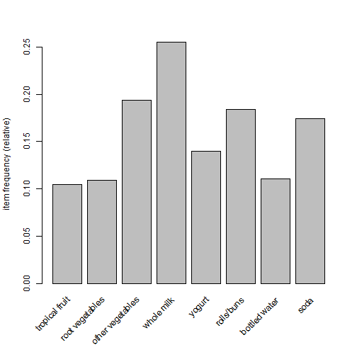
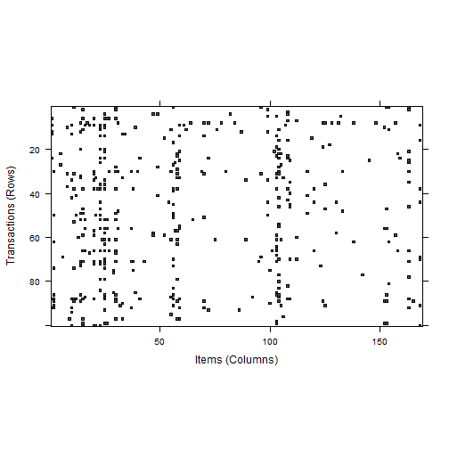
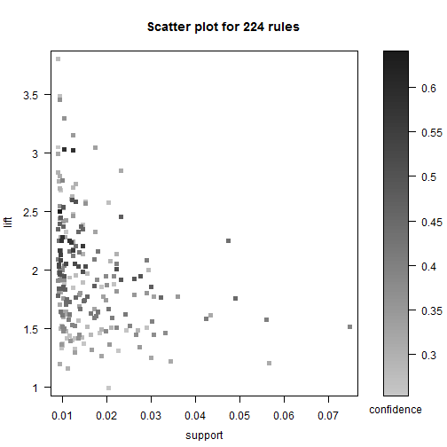
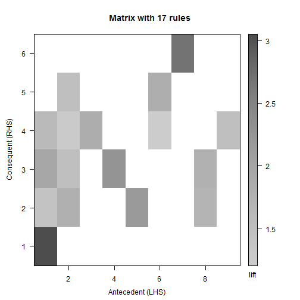
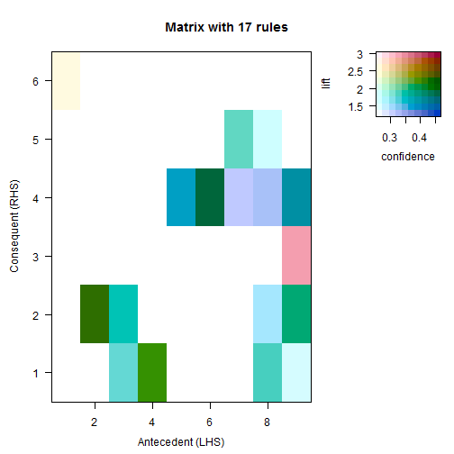
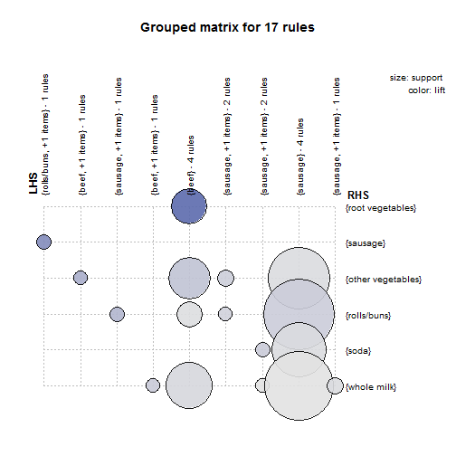
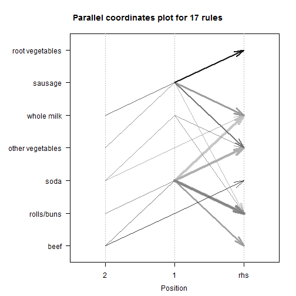

<style>
body {
  background-image:url(dataanalysis.png),url(sharif.png), url(backgrounds.jpg);
  background-repeat: no-repeat;
  background-position:5% 5%, 95% 5%, center center;
  background-size: 50px 50px,50px 50px, cover;
}
slides img{border:0; opacity:0;}
</style>


<a href="#" class="image navigate-down">
  
</a>

Association Rules

<small> Created by: Ahmad Ehyaei</small>

<script src="http://ajax.googleapis.com/ajax/libs/jquery/1.9.1/jquery.min.js"></script>


--- &vertical

### **Association Rules**

There are many ways to see the similarities between items. These are techniques that fall under the general umbrella of association. The outcome of this type of technique, in simple terms, is a set of rules that can be understood as **if this, then that**.

***

### **Applications**

So what kind of items are we talking about? There are many applications of association:

* Product recommendation – like Amazon’s “customers who bought that, also bought this”

* Music recommendations – like Last FM’s artist recommendations
* Medical diagnosis – like with diabetes really cool stuff
* Content optimisation – like in magazine websites or blogs

***

### **The Groceries Dataset**

Imagine 10000 receipts sitting on your table. Each receipt represents a transaction with items that were purchased. The receipt is a representation of stuff that went into a customer’s basket – and therefore ‘Market Basket Analysis’.

That is exactly what the Groceries Data Set contains: a collection of receipts with each line representing 1 receipt and the items purchased. Each line is called a transaction and each column in a row represents an item.

***

**Data**


```r
grocery = readLines("data/groceries.csv")
head(grocery,10)
```

```
 [1] "citrus fruit,semi-finished bread,margarine,ready soups"              
 [2] "tropical fruit,yogurt,coffee"                                        
 [3] "whole milk"                                                          
 [4] "pip fruit,yogurt,cream cheese ,meat spreads"                         
 [5] "other vegetables,whole milk,condensed milk,long life bakery product" 
 [6] "whole milk,butter,yogurt,rice,abrasive cleaner"                      
 [7] "rolls/buns"                                                          
 [8] "other vegetables,UHT-milk,rolls/buns,bottled beer,liquor (appetizer)"
 [9] "pot plants"                                                          
[10] "whole milk,cereals"                                                  
```

```r
basket = lapply(grocery,FUN = function(x) strsplit(x,split = ",")[[1]])
```

***

**Mathematical Formalism**

We already discussed the concept of Items and Item Sets.

We can represent our items as an item set as follows:

$$I = \{ i_1,i_2,…,i_n \}$$

Therefore a transaction is represented as follows:

$$t_n = { i_{j_1},i_{j_2},…,i_{j_k} }$$

This gives us our rules which are represented as follows:

$$\{ i_1,i_2\}  \Rightarrow \{i_k\}$$

A more human readable example is:

$$\{coffee,sugar\}  \Rightarrow \{milk\}$$

--- &vertical


**Association Rules**

For find association rules we can understand three important ratios:

* **Support**: The fraction of which our item set occurs in our dataset.

* **Confidence**: probability that a rule is correct for a new transaction with items on the left.

* **Lift**: The ratio by which by the confidence of a rule exceeds the expected confidence. 

***

**Association Rules**

**Support**

The support value of $X$ ($\mathrm {supp} (X)$) with respect to $T$ is defined as the proportion of transactions in the database which contains the item-set $X$.

**Confidence**

The confidence value of a rule, $X\Rightarrow Y$ , with respect to a set of transactions $T$, is the proportion the transactions that contains $X$ which also contains $Y$.
Confidence is defined as:

$$\mathrm {conf} (X\Rightarrow Y)=\mathrm {supp} (X\cup Y)/\mathrm {supp} (X).$$

***

**Lift**

The lift of a rule is defined as:

$$\mathrm {lift} (X\Rightarrow Y)={\frac {\mathrm {supp} (X\cup Y)}{\mathrm {supp} (X)\times \mathrm {supp} (Y)}}$$

or the ratio of the observed support to that expected if $X$ and $Y$ were independent.


***

**Apriori Recommendation with R**

Association rules are usually required to satisfy a user-specified minimum support and a user-specified minimum confidence at the same time. Association rule generation is usually split up into two separate steps:
* A minimum support threshold is applied to find all frequent item-sets in a database.

* A minimum confidence constraint is applied to these frequent item-sets in order to form rules.

***

**Apriori Algorithm**

Let $X, Y ⊆ I$ be any two itemsets.

Observe that if $X ⊆ Y$ , then $sup(X) ≥ sup(Y)$, which leads to the following two corollaries:

If $X$ is frequent, then any subset $Y ⊆ X$ is also frequent.
If $X$ is not frequent, then any superset $Y ⊇ X$ cannot be frequent.

***

**Apriori Algorithm**


***

**[Apriori Algorithm](http://www.saedsayad.com/)**

* Candidate itemsets are generated using only the large itemsets of the previous pass without considering the transactions in the database.

* The large itemset of the previous pass is joined with itself to generate all itemsets whose size is higher by 1.

* Each generated itemset that has a subset which is not large is deleted. The remaining itemsets are the candidate ones.

***

**[Apriori Algorithm](http://www.saedsayad.com/)**


***

**[Apriori Algorithm](http://www.saedsayad.com/)**

The Apriori algorithm takes advantage of the fact that any subset of a frequent itemset is also a frequent itemset. The algorithm can therefore, reduce the number of candidates being considered by only exploring the itemsets whose support count is greater than the minimum support count. All infrequent itemsets can be pruned if it has an infrequent subset.

--- &vertical

**Find item frequency**


```r
library(arules)
library(arulesViz)
library(colorspace)
data(Groceries)
itemFrequency(Groceries[,1:5])
```

```
## frankfurter     sausage  liver loaf         ham        meat 
## 0.058973055 0.093950178 0.005083884 0.026029487 0.025826131
```

***

Visualize item support - item frequency plots


```r
itemFrequencyPlot(Groceries, support=0.1)
```

 

***


```r
itemFrequencyPlot(Groceries, topN=20)
```

 

***

**Visualizing random 100 transactions**


```r
image(sample(Groceries, 100))
```

 

***

**Implementation of Apriori algorithm**


```r
grules = apriori(Groceries, parameter = list(support = 0.009,
                                             confidence = 0.25, minlen = 2))
```

```

Parameter specification:
 confidence minval smax arem  aval originalSupport support minlen maxlen
       0.25    0.1    1 none FALSE            TRUE   0.009      2     10
 target   ext
  rules FALSE

Algorithmic control:
 filter tree heap memopt load sort verbose
    0.1 TRUE TRUE  FALSE TRUE    2    TRUE

apriori - find association rules with the apriori algorithm
version 4.21 (2004.05.09)        (c) 1996-2004   Christian Borgelt
set item appearances ...[0 item(s)] done [0.00s].
set transactions ...[169 item(s), 9835 transaction(s)] done [0.00s].
sorting and recoding items ... [93 item(s)] done [0.00s].
creating transaction tree ... done [0.00s].
checking subsets of size 1 2 3 4 done [0.00s].
writing ... [224 rule(s)] done [0.00s].
creating S4 object  ... done [0.00s].
```

***

Take a look at some rules


```r
inspect(grules[1:10])
```

```
   lhs                rhs                    support confidence     lift
1  {baking powder} => {whole milk}       0.009252669  0.5229885 2.046793
2  {grapes}        => {other vegetables} 0.009049314  0.4045455 2.090754
3  {meat}          => {other vegetables} 0.009964413  0.3858268 1.994013
4  {meat}          => {whole milk}       0.009964413  0.3858268 1.509991
5  {frozen meals}  => {whole milk}       0.009862735  0.3476703 1.360659
6  {hard cheese}   => {other vegetables} 0.009456024  0.3858921 1.994350
7  {hard cheese}   => {whole milk}       0.010066090  0.4107884 1.607682
8  {butter milk}   => {other vegetables} 0.010371124  0.3709091 1.916916
9  {butter milk}   => {whole milk}       0.011591256  0.4145455 1.622385
10 {ham}           => {other vegetables} 0.009150991  0.3515625 1.816930
```

***

**Understanding association rules**

A common approach is to take the result of learning association rules and divide them into three categories

* Actionable - The goal of a market basket analysis is to find actionable associations, or rules that provide a clear and useful insight. Some rules are clear, others are useful; it is less common to find a combination of both of these factors.

* Trivial - Any rules that are so obvious that they are not worth mentioning, they are clear, but not useful.

* Inexplicable - If the connection between the items is so unclear that figuring out how to use the information for action would require additional research.

***

**Deeper look - sorting the set of association rules**


```r
inspect(sort(grules, by = "lift")[1:8])
```

```
  lhs                   rhs                      support confidence     lift
1 {berries}          => {whipped/sour cream} 0.009049314  0.2721713 3.796886
2 {tropical fruit,                                                          
   other vegetables} => {pip fruit}          0.009456024  0.2634561 3.482649
3 {pip fruit,                                                               
   other vegetables} => {tropical fruit}     0.009456024  0.3618677 3.448613
4 {citrus fruit,                                                            
   other vegetables} => {root vegetables}    0.010371124  0.3591549 3.295045
5 {tropical fruit,                                                          
   other vegetables} => {root vegetables}    0.012302999  0.3427762 3.144780
6 {tropical fruit,                                                          
   other vegetables} => {citrus fruit}       0.009049314  0.2521246 3.046248
7 {beef}             => {root vegetables}    0.017386884  0.3313953 3.040367
8 {citrus fruit,                                                            
   root vegetables}  => {other vegetables}   0.010371124  0.5862069 3.029608
```

***

**Subset of association rules**


```r
beefrules = subset(grules, items %in% c("beef","sausage"))
inspect(sort(beefrules, by = "lift")[1:8])
```

```
  lhs                   rhs                    support confidence     lift
1 {beef}             => {root vegetables}  0.017386884  0.3313953 3.040367
2 {rolls/buns,                                                            
   soda}             => {sausage}          0.009659380  0.2519894 2.682160
3 {beef,                                                                  
   whole milk}       => {other vegetables} 0.009252669  0.4354067 2.250250
4 {sausage,                                                               
   soda}             => {rolls/buns}       0.009659380  0.3974895 2.161034
5 {beef}             => {other vegetables} 0.019725470  0.3759690 1.943066
6 {beef,                                                                  
   other vegetables} => {whole milk}       0.009252669  0.4690722 1.835784
7 {sausage,                                                               
   rolls/buns}       => {soda}             0.009659380  0.3156146 1.809953
8 {sausage}          => {rolls/buns}       0.030604982  0.3257576 1.771048
```

***

**Association rules - Scatter Plot**


```r
plot(grules)
```

 

***

**Association rules - Scatter Plot**


```r
plot(grules, measure=c("support", "lift"), shading="confidence")
```

 

***

**Matrix based visulaization**


```r
plot(beefrules, method="matrix", measure="lift")
```

```
Itemsets in Antecedent (LHS)
[1] "{beef}"                     "{sausage}"                 
[3] "{beef,other vegetables}"    "{beef,whole milk}"         
[5] "{sausage,soda}"             "{sausage,rolls/buns}"      
[7] "{rolls/buns,soda}"          "{sausage,whole milk}"      
[9] "{sausage,other vegetables}"
Itemsets in Consequent (RHS)
[1] "{root vegetables}"  "{rolls/buns}"       "{other vegetables}"
[4] "{whole milk}"       "{soda}"             "{sausage}"         
```

 

***

**Matrix based visulaization**


```r
plot(beefrules, method="matrix", measure=c("lift", "confidence"),
     control=list(reorder=TRUE, col=sequential_hcl(200)))
```

```
Itemsets in Antecedent (LHS)
[1] "{rolls/buns,soda}"          "{beef,whole milk}"         
[3] "{sausage,whole milk}"       "{sausage,soda}"            
[5] "{sausage,other vegetables}" "{beef,other vegetables}"   
[7] "{sausage,rolls/buns}"       "{sausage}"                 
[9] "{beef}"                    
Itemsets in Consequent (RHS)
[1] "{rolls/buns}"       "{other vegetables}" "{root vegetables}" 
[4] "{whole milk}"       "{soda}"             "{sausage}"         
```

 

***

**Grouped Matrix based visualization**


```r
plot(beefrules, method="grouped", measure="support",
     control=list(col=sequential_hcl(100)))
```

 

***

**Graph based visualizations**


```r
plot(beefrules, method="graph", control=list(type="items"))
```

 

***

**Parallel coordinates plot**


```r
plot(beefrules, method="paracoord", control=list(reorder=TRUE))
```

 

***

Saving Association rules


```r
write(grules, file = "data/grules.csv", sep = ",",
      quote = TRUE, row.names = FALSE)
```


--- &vertical

## Thank You for Attention

<a href="#" class="image navigate-down">
  
</a>


